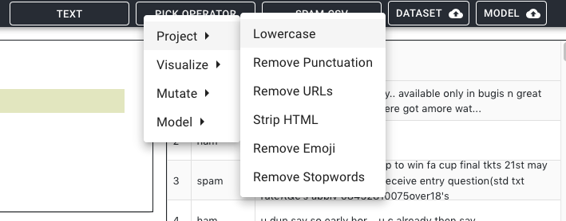
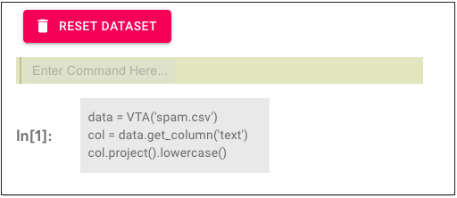
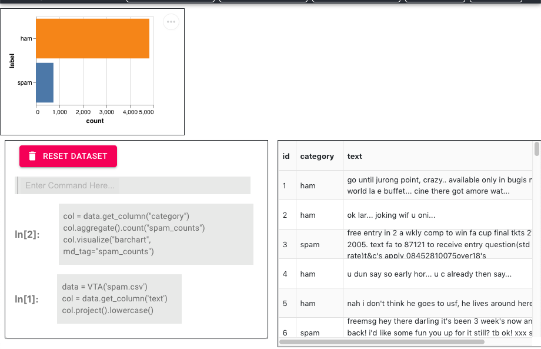
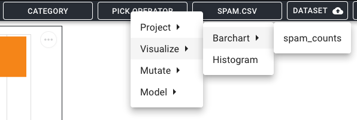
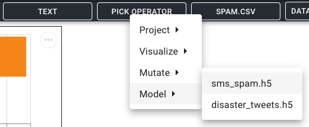

# Leam
`Leam` is a research prototype that combinies the strengths of spreadsheets, computational notebooks, and interactive visualizations to facilitate integrated text analytics. `Leam` implements a visual text algebra to facilitate extensible and expressive analysis, supporting diverse tasks ranging from data cleaning to visualization. It also enables declarative specification of interactive coordination across views of data, code, and visualizations. 

## How to Use
Once you have selected a dataset, you can clean, featurize, apply models, etc. using either the Operator Dropdown which is the GUI interface at the top or by using the Notebook View which accepts Python code. 

### Notebook View
Generally to use the notebook view, the user must either define a reference to the dataset which can be done using a command like `data = VTA("spam.csv")`. This allows the user to call Leam API functions on a VTA object. Also, another common reference needed is a reference to column which can be created using a command like `col = data.get_column("text")`. The `col` variable can then be used to perform tasks like cleaning a column, generating sentiment on that column, etc. To run a command in Notebook View after finishing editing, the user must run `shift+enter` while in the cell. A full API documentation is available in the wiki here: [API reference](https://github.com/megagonlabs/Leam/wiki/VITAL-Documentation). 

***

### Cleaning Text (Method 1: Operator View GUI)
You can lowercase the column `text` in dataset `spam.csv` by selecting the following settings in the Operator View GUI:


### Cleaning Text (Method 2: Notebook View CLI)
Here are the corresponding python commands in Notebook View that clean the `text` column like above:


***

### Create Visualization (Distribution)
Using the `spam.csv` dataset, we can create a distribution visualization for the # of spam vs. non-spam messages easily by creating metadata using the `aggregate` operator and then using that to create a barchart. To do this, run the following in the notebook view:

```python
col = data.get_column("category")
col.aggregate().count("spam_counts")
col.visualize("barchart", md_tag="spam_counts")
```

This will create the following visualization:


Alternatively, once the `spam_counts` metadata is created from the CLI, it can be used to create the same visualization in the Operator View GUI like so:


***

### Apply Model (Using Operator View)
To apply a model to the `text` column to create a new column of predictions, the user can perform the following in the Operator View GUI:


### Apply Model (Using Notebook View)
To apply the same model as above, the user can enter and run the following Python code in the Notebook View:

```python
model = data.get_model("sms_spam.h5")
model.predict("text")
```
You can download the model from this [link.](https://drive.google.com/file/d/1NXX0Z6AtyHx4JJ0B9wTE1PspNN8iiHYa/view?usp=sharing)

***

## Visual Coordination
One experimental feature of SystemX is visual coordination, you can connect visualizations whose base data have 1-1, 1-many, many-1, or many-many relations. At this time, you can connect scatterplot and topword barcharts by their index. For example, in the following gif, the topwords barchart can be connected to the scatterplot by running the following in the notebook view: 
```python
vis2 = data.get_vis(2) # tw barchart
vis2.bi_link(1) # create link scatterplot <-> tw barchart
```
Then you can select a topword in the topword barchart by running `vis2.select("bad")` in the notebook view and see the reviews that contain those words highlighted in the scatterplot


***

## Wiki/Reference

Checkout the Leam [Wiki](https://github.com/megagonlabs/Leam/wiki) to get started. Some quicklinks are follows:
- [VTA Operators](https://github.com/megagonlabs/Leam/wiki/VTA-Operator-Classes)
- [VITAL Documentation](https://github.com/megagonlabs/Leam/wiki/VITAL-Documentation)
- [Leam Architecture Details](https://github.com/megagonlabs/Leam/wiki/Leam-Architecture)
- [VITAL Workflow Examples](https://github.com/megagonlabs/leam/wiki/Example-Workflows)


##  Running Leam from source
1.. Move to root folder and run `docker-compose up` 

This will create three containers
- React (the frontend container running a React.js app)
- Flask (the backend container running a Flask web server)
- Postgres (the DB container running a Postgres instance)

After these containers are fully started, you should be able to visit the frontend by visiting the following url in your browser: http://localhost:3000


### License

MIT
